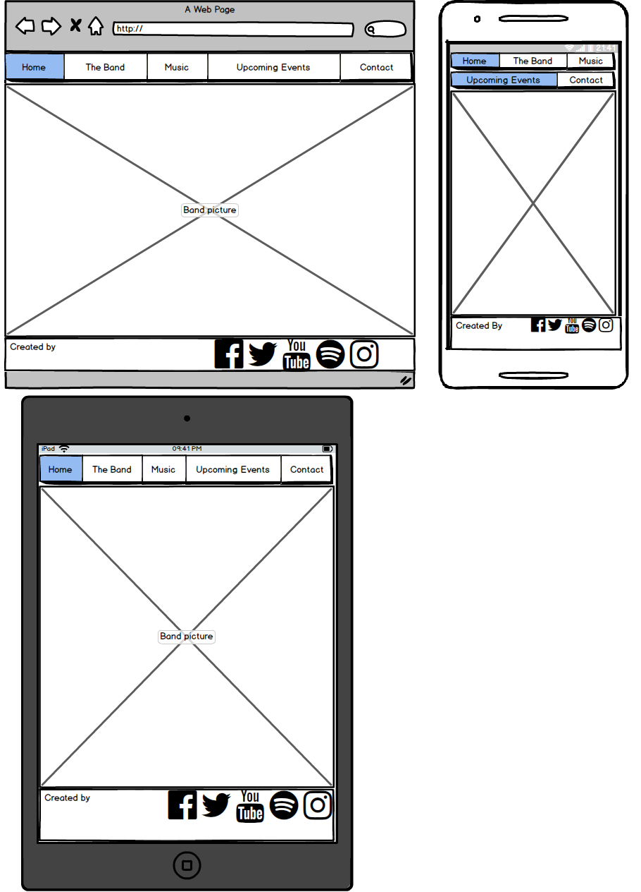

# Queen 

## About the Project:

This website was made as my first Milestone project at Code Institute. My goal was to create a responsive, user centric frontend website using the HTML5 and CSS3 technologies. On this website the user can navigate between the pages easily and they can use the website on every device as a result of responsive design and implementation.

 - During this project I had to create a website for a band, and my choice was the rock-band Queen. Since the website is a static (front-end-only) site, we have narrow options to use it:
   - Check the website on every device easily
   - Navigate between the pages
   - Find information about the band members
   - Listen few of the most famous songs of the band and watch video clip ( I choose this video because it's a live concert video from the year I was born in the city where my family lives.) 
   - Get information about their tour:
     - When will be the next concerts
     - Where will be the next concerts
     - We are able to navigate to the websites where we can actually buy ticket to those concerts with the buy ticket button on the events page
   - Send request for the band if we would like to invite them or ask them to participate in charity or fund events
   - Check the band social sites

 
## Mockups 

**Created with [Balsamiq Mockups 3](https://balsamiq.com/) that is a user interface design tool**

 - **Home Page**:
 

 - **The Band Page**:
 
[QueenTheBandPage](assets/mockups/Queen_mockups/QueenTheBandPage.png)

 - **Music Page**:
 
[QueenMusicPage](assets/mockups/Queen_mockups/QueenMusicPage.png)

 - **Events Page**:
   
[QueenEventsPage](assets/mockups/Queen_mockups/QueenEventsPage.png)

 - **Contact**:
 
[QueenContactPage](assets/mockups/Queen_mockups/QueenContactPage.png) 

## User Stories:

### Navigation:

 - As a user, I would like to use the navigation bar so I am able to reach every page of the website.

 - As a user, I would like to use the "go back" and "go forward" browser button without any error so I can go back and front between the pages more easily.
 
 - As a user, I would like to see a collapsible menu on smaller devices so it would't take up as much space as on larger devices.

### Social links:

 - As a user, I want to click on the social media links so I am able to open the official social media sites of the band in a new tab.

### Responsive:

 - As a user, I want to use the website with every resolution so that on different devices it will work with the same functionality. 

### Effects:

 - As a user, I would like to see the hover effect (cursor: pointer and change color) on the buttons so that I can see there is interaction with that element.

 - As a user, I would like to see the hover effect (cursor: pointer) on the social links so that I can see there is interaction with that element.

 - As a user, I would like to see the hover effect (cursor: pointer) on the navigation bar elements so that I can see that there is an interaction with that element. 
 
### Media:

 - As a user, I would like to play and stop the audio files so I am capable of listening the music.
 - As a user I would like to play and stop the video so I can watch the clip.

### Purchase:
 - As a user I would like to be able to use the "buy ticket" buttons so I can actually can buy tickets for the band events.
 
### Field checking:
 - As a user, I want to fill my details on the Contact page so I can send a request.
 
 - As a user, I want to get notified if I missed to fill a field so I can finish to fill the form.
 
 - As a user I want to get notified if I filled a field in a wrong way so that I can fix it and finish to fill the form.
   
## UX
 
 - I used dark colors on the website, since the subject of this site is a rock band, I thought it would be credible to use black and dark shades as background colors for the navigation bar, footer as well as for the content, and use light color (silver) as an accent for the paragraphs and texts. 

 - The dominant font family is "Fira Sans" which is a google font. I imported this font through the .css style file from the google fonts repository. Sans serif typefaces are considered more modern and include a variety of widths and shapes.The mood and feelings most associated with sans serif typefaces are modern, friendly, direct, clean and minimal, and this is what I was aiming for.
 
 - I used the "font awesome" font and icon toolkit for the social media icons.
 
 - Hover effects on those elements where there is interaction:
   - Navigation
   - Buy Ticket buttons
   - Send Request button
   - Social links
 
 - Favicon (Shortcut icon) with "Q" sign on every page.  
## Features

Because of lack of technology and knowledge (learned only HTML5, CSS3) you only can navigate between the pages and you can reach the outer social sites, as well the actual ticket selling websites for the bands upcoming events. The main feature for this project is the responsive design and implementation of the user centric development.

### Existing Features

 - Collapsible menu on smaller devices:
     - Phones less than 768px

 - Responsive:
   - Every page is responsive, usable and looks good on the below resolution:
     - Phones less than 768px
     - Tablets 768px and over
     - Desktops 992px and over
     - Large desktops 1200px and over
 
 
 - Social links
   - Every icon of the social section is a link to the band official site on that social media site (will open in a new browser window):
     - Facebook
     - Twitter
     - Youtube
     - Spotify
     - Instagram
     
 - Hover effects (cursor: pointer):
   - On the navigation elements
   - On the buttons
   - On the social links 
   
 - Buy tickets:
   - Works as a link to the ticket selling website.
   
 - Send Request:
   - Required fields, mandatory and required format when you fill the form and want to send it.        
 
     

### Features Left to Implement

 - "Send Request" function need to have JavaScript and jQuery technology.

## Technologies Used

- [HTML5](https://www.w3.org/html/)
    - Hypertext Markup Language is the standard markup language for creating web pages and web applications.
   
- [CSS3](https://www.w3.org/Style/CSS/)
    - Cascading Style Sheets is a style sheet language used fro describing the presentation of a document written in a markup language like HTML.

- [Bootstrap 4.3.1](https://getbootstrap.com/docs/4.3/) 
    - Front End Framework for developing responsive websites.
    
- [Git](https://git-scm.com/)
    - Git is a distributed version-control system for tracking changes in source code during sofware development.    

- [GitHub](https://github.com/)
    - GitHub Inc. is a web-based hosting service for version control using Git.     

- [JQuery](https://jquery.com)
    - The project uses **JQuery** to simplify DOM manipulation.

## Testing

Thanks to the "GitHub Pages" option on the GitHub website everybody can reach my website through the below link:

Visit the website: [link](https://timeakovacs86.github.io/FirstMilestoneProject-Queen/)

I prefer the GitHub Pages option instead of the Cloud9 because it is stable and available 24/7.

**Test cases for the user stories:**

- Navigation
  - Navigation (Navigation links)
    - I am on the one page and I click on another one page's link so the expected page will be loaded.
   Navigation ("Go back" and "Go forward" browser button)
    - I am on the one page and I click on the another page's link. I click on the "go back" browser button and the expected page will be loaded without any error. 
    After this I click on the "go forward" browser button and the expected page will be loaded without any error.   
  - Collapsible menu:
    - If the resolution is smaller than 768 px, then a collapsible (hamburger) menu is available instead of the one on larger devices.
- Social link
    - I click on one of the social link and the band's page will open in a new tab.

- Responsive
    - I grab the edge of the browser and modify the resolution. After this the website is still usable and looks good.
    - Chrome developer tools: details below at the **Chrome Developer Tool** section

- Effects
    - I hover my mouse over the  navigation link,I can see the hover effect (cursor: pointer).
    - I hover my mouse over the  social link and I can see the hover effect (cursor: pointer).
    - I hover over the buy ticket button and I see the button hover effect (cursor: pointer and change color). 
    
- Media
    - I click on "play" button at one of the music audio player and it starts to play the music.
    - While the music is playing I click on the stop button and the music stops.
    - I click on the video player and the video starts to play.
    - While the video is playing I click on the stop button and the video stops.
    
- Purchase
    - I click on any of the "buy ticket" buttons on the Events page, and it will open the actual website of the ticket selling company in a new tab in the browser where I can purchase the ticket for the event I was just choose to buy ticket for.     
    
- Field checking (Contact Page)
    - I fill the required fields and after clicking the "Send request" button, I can send my message. (At the moment the sending function is not working. Instead of that the page will reloaded).
    - I miss to fill the name field and I get feedback about the wrong format when I click on the "Send request" button.
    - I fill the e-mail field without e-mail format and I get feedback about the wrong format when I click on the "Send request" button.
    - I miss to fill the phone field and I get feedback about the wrong format when I click on the "Send request" button.
    - I miss the description field and I get a notification that I missed to fill that field when I click on the "Send request" button.  

**Tested browsers:**
 - Chrome
 - Mozilla Firefox
 - Microsoft Edge

**Testing Tools:**
 - Chrome browser built-in developer tool
 - PC with HD resolution (with real usage)
 - Mobile Phones: 
    - Iphone SE
    - OnePlus 6T

**Chrome Developer Tool:**
- With the "Responsive" option I made boundary testing on the edges where the resolution changed from:
    - Large desktop to desktop (Tested pixel width values: 1201px, 1200px, 1199px)
    - Desktop to tablet (Tested pixel width values: 993px, 992px, 991px)
    - Tablet to phone (Tested pixel width values: 769px, 768px, 767px)
- Phone and Tablet resolution
    - Usage on the different device resolutions like "Pixel 2" and "iPad"
- Console log error checking on every page during the testing
 
**Testing people:**
- Acquaintance
- Friends
- Myself  

Known console log error: 
  - I recognized a error message which has something to do with the security of the embedded iframe, but it doesn't cause any issues while loading or using the website.
   
## Deployment

How I implement this project:

- **Set up**:
    - I use local IDE for create the project, I installed the Git locally and synchronized my local IDE 
    with the local git. I use IntelliJ Pycharm for the front end development with its helpful built in deployment tools. 
    After I created a Git and GitHub repository, I could start to work and I could test my features locally.
    I could see my changes locally to open my index.html file with the View/Open browser menu option in my local IDE.
    Here I could choose the required browser which I want to use. (Chrome, Mozilla, etc.)
- **Commits**:
    - After every small piece and increment, I made commit to my local Git repository. After that in the end of the 
    bigger section that gives value to my project I pushed my modification to my online GitHub repository.
    - For the development I only use one branch called "master".
- **Local and online deployment**
    - Locally: It is very easy to clone repository from my account if you follow these steps:
        1. Follow this link [Project GitHub repository](https://github.com/TimeaKovacs86/FirstMilestoneProject-Queen) 
        2. Under the repository name, click "Clone or download".
        3. Here you have to copy the url's of the repository
        4. In your local IDE you can choose to create new project from version control/Git 
        5. Paste the link there that you copied before
        6. For additional help you can more information under this [link](https://help.github.com/en/articles/cloning-a-repository)
        
    - Online:
        - When there was a working increment after pushing it to my online GitHub repository I could test it online with real usage.
        For this I followed these steps:
            1. Under [my project GitHub directory](https://github.com/TimeaKovacs86/FirstMilestoneProject-Queen) from the menu items I clicked on the Settings 
            2. Under the GitHub Pages section I could set up my online site from my master branch.
            3. After few minutes the online deployed site was available the given [link](https://timeakovacs86.github.io/FirstMilestoneProject-Queen/)

## Content

### The text for the Band members was copied from:

 - About Freddie Mercury:
   - [Wikipedia article](https://en.wikipedia.org/wiki/Freddie_Mercury)
 - About Brian May:
   - [Wikipedia article](https://en.wikipedia.org/wiki/Brian_May) 
 - About Roger Taylor:
   - [Wikipedia article](https://en.wikipedia.org/wiki/Roger_Taylor_(Queen_drummer))
 - About John Deacon:
   - [Wikipedia article](https://en.wikipedia.org/wiki/John_Deacon)
 
 - Favicon:
   - [QueenOnline.com]((http://www.queenonline.com/global/assets/modules/site/images/favicon.ico))      

### Media

Home page background picture: [link](https://parsseh.com/wp-content/uploads/2014/03/Queen-Band-640x378.jpg)

Other pages background picture: [link](https://qulari.com/freddie-mercury.html?fbclid=IwAR3ntc9UwOwjGETLl_LWQmbMT-1WKWeo-Ihab-o-EQkonsKt5pFip_6WtqA)

- Band members profile pictures for the bio
    - Freddie Mercury profile picture: [link](https://scontent-frx5-1.cdninstagram.com/vp/78c6ad1b15fa96452d7f1b7e0b34f6c0/5D65A9A0/t51.2885-15/e35/58410503_596331797443202_1143175526350109907_n.jpg?_nc_ht=scontent-frx5-1.cdninstagram.com)
    - Brian May profile picture: [link](https://i.pinimg.com/736x/20/c0/1e/20c01e2a4155086e7b627cd1801f3794.jpg)
    - Roger Taylor profile picture: [link](https://encrypted-tbn0.gstatic.com/images?q=tbn:ANd9GcT1FKC7r6dEG3-tar40noUhhrixlaa1V5jclWhJTE8gV5wpDoF1fg)
    - John Deacon profile picture: [link](https://66.media.tumblr.com/c2638c610e07ef89ade1201b88e8e487/tumblr_piuo32zb4N1valwms_500.jpg)

- Album cover pictures:
    - A night at the opera: [link](https://en.wikipedia.org/wiki/A_Night_at_the_Opera_(Queen_album)#/media/File:Queen_A_Night_At_The_Opera.png)
    - The Game: [link](https://upload.wikimedia.org/wikipedia/en/thumb/1/16/Queen_The_Game.png/220px-Queen_The_Game.png)
    - Jazz: [link](https://upload.wikimedia.org/wikipedia/en/thumb/0/06/Queen_Jazz.png/220px-Queen_Jazz.png)
    - News of the World: [link](https://en.wikipedia.org/wiki/News_of_the_World_(album)#/media/File:Queen_News_Of_The_World.png)

- Audio files: Since I have the original Queen Greatest Hits album, which comes with the coupon what allows you to download the entre album, I used my own audio files to create the Music page.

- Video file: Youtube video source (https://www.youtube.com/watch?v=bMPOMT251mQ)

### Assessment

